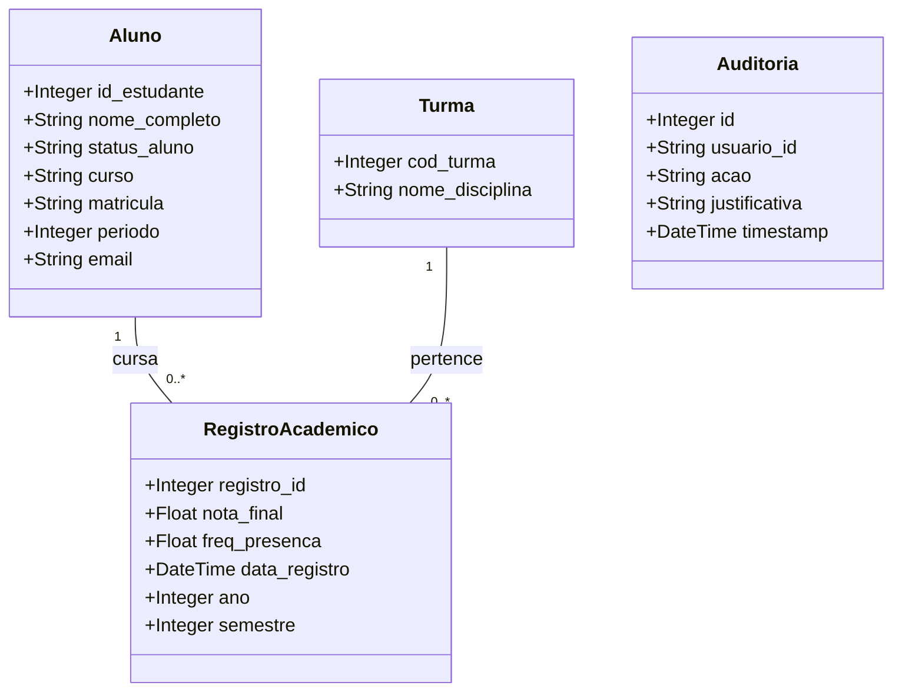

# SIMPA — Sistema Inteligente de Monitoramento e Predição Acadêmica (AVAL<IA>)

Projeto Integrador — 2º Período | Curso de Inteligência Artificial | UniEvangélica  
Prof. Henrique Lima

## Marco 3 - Evolução Analítica e Normalização (Nível 2)

O SIMPA transitou de um sistema analítico básico para uma plataforma de inteligência educacional robusta. Esta versão inclui Banco de Dados Normalizado (3NF), Autorização Baseada em Perfis (RBAC), Validação Estrita de Dados de Entrada com Pydantic, e Visualizações de Dados Avançadas com a biblioteca Bokeh.

---

## 1. Como Usar o Sistema (Guia do Usuário)

O AVAL<IA> permite o controle de desempenho e predição de risco dos estudantes. O sistema varia as funções de acordo com o seu **Perfil de Acesso**.

### Autenticação
1. Acesse o sistema utilizando suas credenciais (matrícula e senha).
2. O sistema identificará automaticamente seu nível de acesso: `Diretoria (admin)`, `Coordenador`, `Professor` ou `Visualizador`.

### Funcionalidades
* **Diretoria/Coordenador:** Podem acessar o dashboard com visão macro (Toda Instituição / Curso). Podem importar planilhas através de Links do Google Sheets.
* **Professor:** Acesso restrito às suas turmas/alunos. Recebe notificações automáticas de risco acadêmico dos seus alunos.
* **Importação em Lote:** É possível enviar um link público do Google Sheets no formato CSV para o sistema processar a carga inicial de alunos, notas e frequências. Apenas dados válidos (Nota 0-10, Frequência 0-100) serão absorvidos. O sistema tratará a substituição ou inserção automática.
* **Dashboards:** Visualize Histograma de Desempenho, Dispersão de Assiduidade e Boxplot de Variabilidade diretamente integrados com Bokeh.
* **Consolidado do Aluno (Visão 360º):** Permite clicar em qualquer aluno na tabela detalhada de turmas para abrir um modal contendo ficha de risco, lista de evidências pedagógicas, histórico de evolução por período (gráfico de linha) e 4 gráficos comparativos individuais (Média Geral, Frequência Média, IAA e IRP) contra a média da respectiva turma dispostos em um grid 2x2 responsivo. Os gráficos utilizam colorização dinâmica inteligente (verde `#10b981` para cima/na média da turma, vermelho `#f43f5e` para abaixo da média) e setas direcionais (▲/▼) no título para diagnóstico visual imediato.

---

## 2. Dicionário de Dados e Normalização (3NF)

O banco SQLite foi migrado para a 3ª Forma Normal.

* `alunos`: `id_estudante` (PK), `nome_completo`, `status_aluno`, `curso`, `matricula`, `periodo`, `email`.
* `turmas`: `cod_turma` (PK), `nome_disciplina`.
* `registros_academicos`: `registro_id` (PK), `id_estudante` (FK), `cod_turma` (FK), `nota_final`, `freq_presenca`, `data_registro`, `ano`, `semestre`.
* `auditoria`: `id`, `timestamp`, `usuario_id`, `acao`, `recurso`, `valor_antigo`, `valor_novo`, `justificativa`, `ip`.

### Anonimização (LGPD)
Sempre que um usuário `Visualizador` requisita dados que contenham informações pessoalmente identificáveis (PII), nomes e e-mails são anonimizados pelo sistema na camada de resposta. Logs são mantidos em todas as ações sensíveis no banco `auditoria`.

---

## 3. Contrato da API REST (OpenAPI/Swagger Resumido)

### Auth
* **POST `/auth/login`**: Realiza autenticação, retorna Token JWT-like.
* **POST `/auth/logout`**: Encerra sessão.

### Alunos e Registros
* **GET `/alunos`**: Retorna lista de estudantes (anonimizado dependendo do perfil).
* **POST `/alunos`**: Cadastra aluno (Validado via Pydantic).
* **POST `/alunos/<id>/notas`**: Lança notas.
* **POST `/alunos/<id>/frequencias`**: Lança frequências.

### Indicadores e Gráficos
* **GET `/indicadores/<aluno_id>`**: Retorna indicadores.
* **POST `/indicadores/<aluno_id>/gerar`**: Processa cálculo de risco.
* **GET `/api/charts/geral`**: Retorna instâncias `script` e `div` HTML dos gráficos construídos com Bokeh.
* **GET `/api/alunos/<matricula>/consolidado`**: Retorna dados demográficos do aluno, risco, evidências pedagógicas, histórico de evolução e 5 gráficos Bokeh (evolução temporal de notas + 4 gráficos comparativos individuais de indicadores contra a média da turma respectiva).

### Importação de Planilha
* **POST `/api/importar/confirmar`** (Adaptado): Suporta importação via Pydantic model (`services/import_service.py`) usando link do Google Sheets.

---

## 4. Diagramas UML

### Diagrama de Classes (Refletindo a 3NF)



### Diagrama de Casos de Uso (Perfis de Acesso)

```mermaid
usecaseDiagram
    actor Diretoria
    actor Coordenador
    actor Professor
    actor Visualizador

    usecase "Ver Relatórios Institucionais" as UC1
    usecase "Ver Relatórios do Curso" as UC2
    usecase "Acompanhar Alunos (Risco)" as UC3
    usecase "Lançar Notas/Frequência" as UC4
    usecase "Consultar Dados Anonimizados" as UC5
    usecase "Importar Dados Google Sheets" as UC6

    Diretoria --> UC1
    Diretoria --> UC6
    Coordenador --> UC2
    Coordenador --> UC6
    Professor --> UC3
    Professor --> UC4
    Visualizador --> UC5
```

---

## 5. Como Executar o Sistema

```bash
# 1. Instalar dependências exatas (inclui Bokeh, Pydantic, etc)
pip install -r requirements.txt

# 2. Inicializar banco e aplicar migrações para 3NF
python -c "from services.database import init_db; init_db()"

# 3. Rodar os testes de unidade
python -m pytest tests/ -v

# 4. Iniciar Servidor (Acesse http://localhost:5000)
python api/app.py
```
